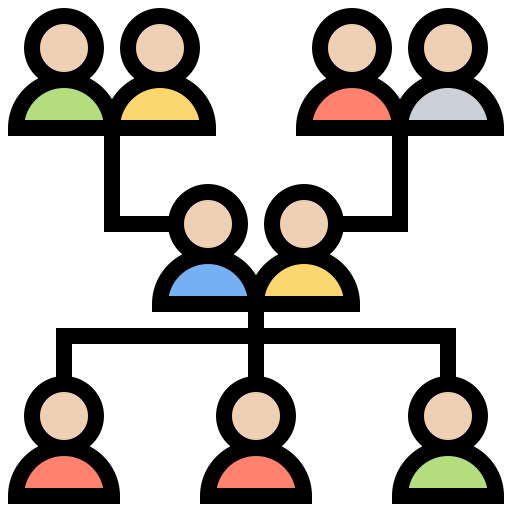

<!-- Template from https://github.com/othneildrew/Best-README-Template>  -->
<a name="readme-top"></a>


[![Stargazers][stars-shield]][stars-url]
[![Issues][issues-shield]][issues-url]
[![MIT License][license-shield]][license-url]


<!-- PROJECT LOGO -->
<br />
<div align="center">
  <a href="https://github.com/luni64/rmSharp">
    
  </a>

<h3 align="center">rmSharp</h3>

  <p align="center">
    Entity Framework Core ORM to work with SQLite databases created by
     <a href="https://www.rootsmagic.com/">RootsMagic &copy;</a>
    <br />
    <br />
    ·
    <a href="https://github.com/luni64/rmSharp/issues/new?labels=bug&template=bug-report---.md">Report Bug</a>
    ·
    <a href="https://github.com/luni64/rmSharp/issues/new?labels=enhancement&template=feature-request---.md">Request Feature</a>
  </p>
</div>


<!-- TABLE OF CONTENTS -->
<details>
  <summary>Table of Contents</summary>
  <ol>
    <li>
      <a href="#about-the-project">About The Project</a>
    </li>
    <li>
      <a href="#getting-started">Getting Started</a>
      <ul>
        <li><a href="#dependencies">Dependencies</a></li>
        <li><a href="#installation">Installation</a></li>
      </ul>
    </li>
    <li>
      <a href="#object-relational-mapping-orm">Object Relational Mapping (ORM)</a>
    </li>
    <li>
      <a href="#usage-examples">Usage Examples</a>
      <ul>
        <li><a href="#print-all-primary-names">Print all Primary Names</a></li>
        <li><a href="#persons-children-and-events">Persons, Children and Events</a></li>
      </ul>
    </li>
    <li><a href="#license">License</a></li>
  </ol>
</details>


<!-- ABOUT THE PROJECT -->
## About The Project

[RootsMagic&copy;](https://rootsmagic.com/) is a genealogy application which
uses an SQLite database to store its data. rmSharp helps working with this
database in an object oriented way without deeper knowledge of the
underlying SQL query language. Probably, the main use case is to perform
more complicated queries which might not be provided by the RootsMagic &copy;
application.

However, rmSharp can also be used to manipulate the database. E.g., to add
new persons, events, tasks, groups programmatically.

**Disclaimer:** Be sure to back up your database before using rmSharp to make changes. rmSharp is well tested, but bugs that could potentially corrupt your database cannot be excluded. It is recommended that you carefully check the integrity of your database after making changes with rmSharp.

<p align="right">(<a href="#readme-top">back to top</a>)</p>


## Getting Started
### Dependencies

The library was compiled using the community edition of Visual Studio 2022. It depends on the following packages available on nuget:
* [Entity Framework Core](https://www.nuget.org/packages/Microsoft.EntityFrameworkCore/) (Microsoft)
* [Entity Framework Core Proxies](https://www.nuget.org/packages/Microsoft.EntityFrameworkCore.Proxies) (Microsoft)
* [Entity Framework Core SQLite](https://www.nuget.org/packages/Microsoft.EntityFrameworkCore.Sqlite) (Microsoft)
* [Delegate Decompiler](https://www.nuget.org/packages/DelegateDecompiler) (Alexander Zaytsev)
* [Geolocation](https://www.nuget.org/packages/Geolocation) (Scott Schluer)


### Installation

* For ease of use, rmSharp is available as a [nuget package](https://www.nuget.org/packages/lunOptics.rmSharp/) to be used in your own projects.
* If you prefer to install rmSharp locally, you can download the repository from GitHub. It contains the required solution (*.sln) and project (*.csproj) files to build the library and the included examples. During the first build, the VS package manager will automatically install all dependencies.
<p align="right">(<a href="#readme-top">back to top</a>)</p>


## Object Relational Mapping (ORM)

The Entity Framework is the standard Microsoft tool for generating and working with object-oriented models which abstract the underlying database. See [this](https://en.wikipedia.org/wiki/Object-relational_mapping) Wikipedia article for details about object relational mapping (ORM). Corresponding tutorials are readily available on the web. See e.g:
* https://learn.microsoft.com/en-us/ef/core/get-started/overview/first-app
* https://learn.microsoft.com/en-us/dotnet/csharp/linq/standard-query-operators/

 The rmSharp model uses the following naming convention to map database tables to C# tables (i.e., `dbSet<T>` types) and model entities. First of all, the model tables are named after the database tables but remove the "Table" postfix and pluralize the original name. The table **rows** map to simple POCOs (plain old C# objects) which are named using the singular of the table names. E.g., the database table `NameTable`  maps to the model table `Names` which consists of a collection of `Name` objects. The `TaskTable` maps to a set of `Task` objects and is named `Tasks` etc.

### Example: NameTable

Here an example using the database table `NameTable` which is structured in the following way. (Detailed information about all tables can be found here: https://sqlitetoolsforrootsmagic.com/)

```
CREATE TABLE NameTable (
    NameID     INTEGER PRIMARY KEY,
    OwnerID    INTEGER,
    Surname    TEXT    COLLATE RMNOCASE,
    Given      TEXT    COLLATE RMNOCASE,
    Prefix     TEXT    COLLATE RMNOCASE,
    Suffix     TEXT    COLLATE RMNOCASE,
    Nickname   TEXT    COLLATE RMNOCASE,
    NameType   INTEGER,
    Date       TEXT,
    SortDate   BIGINT,
    IsPrimary  INTEGER,
    IsPrivate  INTEGER,
    Proof      INTEGER,
    Sentence   TEXT,
    Note       TEXT,
    BirthYear  INTEGER,
    DeathYear  INTEGER,
    Display    INTEGER,
    Language   TEXT,
    UTCModDate FLOAT,
    SurnameMP  TEXT,
    GivenMP    TEXT,
    NicknameMP TEXT
);
```
rmSharp maps the rows of this table to the following entity class:

```C#
public partial class Name
{
    public long NameId { get; set; }
    public long OwnerId { get; set; }
    public string Surname { get; set; } = string.Empty;
    public string Given { get; set; } = string.Empty;
    public string Prefix { get; set; } = string.Empty;
    public string Suffix { get; set; } = string.Empty;
    public string Nickname { get; set; } = string.Empty;
    public NameTypes NameType { get; set; } = NameTypes.Primary; // <- mapped from long to NameType enumeration
    public string Date { get; set; } = ".";
    public long SortDate { get; set; }
    public bool IsPrimary { get; set; } = true;       // <- mapped from long to bool
    public bool IsPrivate { get; set; } = false;      // <- mapped from long to bool
    public Proof Proof { get; set; } = Proof.unknown; // <- mapped from long to Proof enumeration
    public string Sentence { get; set; } = string.Empty;
    public string Note { get; set; } = string.Empty;
    public long BirthYear { get; set; }
    public long DeathYear { get; set; }
    public long Display { get; set; }
    public string Language { get; set; } = string.Empty;
    public string SurnameMp { get; set; } = string.Empty;
    public string GivenMp { get; set; } = string.Empty;
    public string NicknameMp { get; set; } = string.Empty;
    public DateTime ChangeDate { get; set; }          // <- mapped type from float to DateTime and changed name from UTCModDate to ChangeDate

    // Navigation
    public virtual ICollection<Citation> Citations { get; set; } = [];
    public virtual ICollection<Task> Tasks { get; set; } = [];

    // Helpers
    public override string ToString() => $"{Surname} {Given}";
}
```
where the enums `NameTypes` and `Proof` are defined as
```C#
 public enum NameTypes { Primary = 0, AKA = 1, Birth = 2, Immigrant = 3, Maiden = 4, Married = 5, Nickname = 6, OtherSpelling = 7 };
 public enum Proof { unknown = 0, proven = 1, disproven = 2, disputed = 3 };
 ```

The first part of the `Name` entity is a more or less a 1:1 translation of the table columns to C# types. For convenience, however, rmSharp introduces
the following bidirectional conversions:

* The table columns `NameType` and `Proof` are converted from `long` to C# enumerations.
* The `IsPrimary` and `IsPrivate` flags are converted from `long` to boolean values.
* In the model the table column `UTCModDate` is renamed to `ChangeDate` and is converted from an encoded `float` value to the standard C#-type `DateTime`.

The properties in the **navigation** section of the `Name` entity model the relation to other entities. A `Name` can have zero or many citations which is modeled by the `Citations` collection. Also, it can have one or many Tasks, modeled by the `Tasks` collection. If you query for a `Name` in the `Names` table, the Entity Framework automatically generates an SQL query joining the tables `CitationTable` and `TaskTable` and fills the Citations and Tasks collections correspondingly.

## Usage Examples

Here some simple examples showing how to use the library. The corresponding project files can be found in the folder `src/Examples` of the repository. The examples use various databases stored in the folder `src/Examples/example_databases`

### Print all Primary Names

RM can store more than one name for a person. It uses the `NameType` column to distinguish between 'primary', 'birth', 'maiden',... names.
The following code shows how to extract and print all primary names, i.e. names with `NameType` set to `NameType.Primary' from the database.


```C#
 static void Main(string[] args)
{
    DB.sqLiteFile = "../../../../example_databases/US_Presidents.rmTree";  // database file

    using (var db = new DB())  // connect to the database
    {
        var primaryNames = db.Names                       // query the Names table
            .Where(n => n.NameType == NameTypes.Primary)  // filter out all primary names...
            .OrderBy(n => n.Surname);                     // ...and order them by surname

        foreach (var name in primaryNames)
        {
            WriteLine(name.Surname + " " + name.Given);
        }
    }
}
```
Which prints:
```
...
Reade George
Reade Robert
Reade Andrew
REAGAN Michael
REAGAN John
REAGAN John Edward
REAGAN Ronald Wilson
REAGAN Patricia_Ann DAVIS
REAGAN Ronald Prescott
REAGAN John Neil
REAGAN Maureen Elizabeth
REAGAN Michael Edward
REAGAN Cameron Michael
REAGAN ? (Girl)
Record Margaret
...
```

To query the database the Entity Framework automatically generates the required SQL command and sends it to the database. We can have a look at the generated SQL command by adding

```C#
Console.WriteLine(primaryNames.ToQueryString());
```
to the code above. This will print:
```
SELECT *
FROM "NameTable" AS "n"
WHERE "n"."NameType" = 0
ORDER BY "n"."Surname"
```

### Persons, Children and Events

Here a more interesting example showing how to query the PersonTable. The code first filters the persons for all male individuals having the surname "Jefferson". It then uses the `Events` navigation property of the found individuals and filters those for a birth event. If it found one, it reads out the `Date` property of the event and adds it to the printout of the individuals name. Finally it uses the `Children` navigation property to print all children belonging to the person.

```c#
 static void Main(string[] args)
 {
     DB.sqLiteFile = "../../../../example_databases/US_Presidents.rmTree";  // database file to be set only once

     using (var db = new DB())
     {
         var jeffersons = db.Persons.Where(p => p.PrimaryName.Surname == "Jefferson" && p.Sex == Sex.Male);  // get all male Jeffersons from the database

         foreach (var person in jeffersons)
         {
             Write(person.PrimaryName);

             var birthEvent =
                  person
                 .Events                                 // query the events belonging to this person
                 .Where(e => e.FactType.Name == "Birth") // filter for birth events
                 .SingleOrDefault();                     // get the event or null if none - or more than one which should not happen of course)

             if (birthEvent != null)                     // if we have a birth event we print its Date property
             {
                 Write($" (*{birthEvent.Date})");
             }
             WriteLine();

             foreach (var child in person.Children)      // print primary name and sex of all children
             {
                 WriteLine($"  - {child.PrimaryName} ({child.Sex})");
             }
         }
     }
 }
```
It prints:
```
Jefferson Thomas (*13 APR 1743)
  - Jefferson Martha (Patsy) (Female)
  - Jefferson Jane Randolph (Female)
  - Jefferson ? (unnamed son) (Male)
  - Jefferson Mary (Maria) (Female)
  - Jefferson Lucy Elizabeth (Female)
  - Jefferson Lucy Elizabeth (Female)
Jefferson ? (unnamed son) (*28 MAY 1777)
Jefferson Peter (*1708)
  - Jefferson Jane (Female)
  - Jefferson Mary (Female)
  - Jefferson Thomas (Male)
  - Jefferson Elizabeth (Female)
  - Jefferson Martha (Female)
  - Jefferson Peter Field (Male)
  - Jefferson ? (unnamed Son) (Male)
  - Jefferson Lucy (Female)
  - Jefferson Anna Scott (Female)
  - Jefferson Randolph (Male)
Jefferson Peter Field (*1748)
Jefferson ? (unnamed Son) (*1750)
Jefferson Randolph (*1755)
Jefferson Thomas (*)
  - Jefferson Peter (Male)
```


**For more examples, please refer to the [Example folder](../src/Examples/)**

<p align="right">(<a href="#readme-top">back to top</a>)</p>


<!-- LICENSE -->
## License

Distributed under the MIT License. See `LICENSE.txt` for more information.

<p align="right">(<a href="#readme-top">back to top</a>)</p>


<!-- CONTACT -->
<!-- ## Contact

Your Name - [@twitter_handle](https://twitter.com/twitter_handle) - email@email_client.com

Project Link: [https://github.com/luni64/rmSharp](https://github.com/luni64/rmSharp)

<p align="right">(<a href="#readme-top">back to top</a>)</p> -->


<!-- ACKNOWLEDGMENTS -->
<!-- ## Acknowledgments

* []()
* []()
* []()

<p align="right">(<a href="#readme-top">back to top</a>)</p> -->


<!-- MARKDOWN LINKS & IMAGES -->
<!-- https://www.markdownguide.org/basic-syntax/#reference-style-links -->
[contributors-shield]: https://img.shields.io/github/contributors/luni64/rmSharp.svg?style=for-the-badge
[contributors-url]: https://github.com/luni64/rmSharp/graphs/contributors
[forks-shield]: https://img.shields.io/github/forks/luni64/rmSharp.svg?style=for-the-badge
[forks-url]: https://github.com/luni64/rmSharp/network/members
[stars-shield]: https://img.shields.io/github/stars/luni64/rmSharp.svg?style=for-the-badge
[stars-url]: https://github.com/luni64/rmSharp/stargazers
[issues-shield]: https://img.shields.io/github/issues/luni64/rmSharp.svg?style=for-the-badge
[issues-url]: https://github.com/luni64/rmSharp/issues
[license-shield]: https://img.shields.io/github/license/luni64/rmSharp.svg?style=for-the-badge
[license-url]: https://github.com/luni64/rmSharp/blob/master/LICENSE.txt
[linkedin-shield]: https://img.shields.io/badge/-LinkedIn-black.svg?style=for-the-badge&logo=linkedin&colorB=555
[product-screenshot]: images/screenshot.png
[Next.js]: https://img.shields.io/badge/next.js-000000?style=for-the-badge&logo=nextdotjs&logoColor=white
[Next-url]: https://nextjs.org/
[React.js]: https://img.shields.io/badge/React-20232A?style=for-the-badge&logo=react&logoColor=61DAFB
[React-url]: https://reactjs.org/
[Vue.js]: https://img.shields.io/badge/Vue.js-35495E?style=for-the-badge&logo=vuedotjs&logoColor=4FC08D
[Vue-url]: https://vuejs.org/
[Angular.io]: https://img.shields.io/badge/Angular-DD0031?style=for-the-badge&logo=angular&logoColor=white
[Angular-url]: https://angular.io/
[Svelte.dev]: https://img.shields.io/badge/Svelte-4A4A55?style=for-the-badge&logo=svelte&logoColor=FF3E00
[Svelte-url]: https://svelte.dev/
[Laravel.com]: https://img.shields.io/badge/Laravel-FF2D20?style=for-the-badge&logo=laravel&logoColor=white
[Laravel-url]: https://laravel.com
[Bootstrap.com]: https://img.shields.io/badge/Bootstrap-563D7C?style=for-the-badge&logo=bootstrap&logoColor=white
[Bootstrap-url]: https://getbootstrap.com
[JQuery.com]: https://img.shields.io/badge/jQuery-0769AD?style=for-the-badge&logo=jquery&logoColor=white
[JQuery-url]: https://jquery.com
